# Correcciones y últimos retoques del European Observatory of Drone Incidents

8 y 9 de octubre de 2026. Tres bloques de piezas pequeñas y cerradas, en orden. Todo entró por PR
con las comprobaciones en verde, fusionado con `gh pr merge --rebase` fuera de los minutos 12 a 40.
Lo que toca la recogida o los datos llevó antes el ensayo completo de recogida y exportación
semanal sobre una copia de la base real (`servidor/ensayo.sh` con `ENSAYO_EXPORTACION=1`, trabajo de
sesión con 3 GB como mucho).

| PR | Bloque | Qué | Ensayo | Fusionado (UTC) |
| --- | --- | --- | --- | --- |
| #180 | 1 | Registro público de correcciones | código 0 | 8 oct, 21:41 |
| #181 | 2 | Versiones citables de los datos abiertos | código 0 | 8 oct, 21:46 |
| #182 | 3.2 | Nombres de lugar en el idioma de cada página | solo web | 9 oct, 01:06 |
| #183 | 3.3 | Licencia dentro de los ficheros públicos del almacén | código 0 | 9 oct, 01:41 |
| #184 | 3.4 | Notas posteriores sobre sucesos ya registrados se unen solas | código 0 | 9 oct, 01:46 |
| #185 | 3.1 | Accesibilidad de los marcadores y contraste de los nombres del mapa | solo web | 9 oct, 01:51 |

## Bloque 1. Registro público de correcciones (#180)

**Qué se ve.** Una página de texto nueva, «Registro de correcciones» (`/correcciones/registro`) y
«Corrections log» (`/en/corrections/log`), que se lee sin ejecutar código y está en el sitemap y
en llms.txt. Se enlaza desde «Correcciones» (apartado nuevo «Qué se ha corregido»), desde
«Metodología y datos abiertos» (en la web y en su página de texto) y desde el pie de todas las
páginas de texto; nunca desde la pantalla del mapa. Cada corrección dice la fecha, el incidente
(enlazado a su ficha si se sigue publicando; si se retiró, «ya no se publica»), qué cambió (el
titular antes y ahora, el estado, la presencia del dron y el lugar de antes a ahora, «atribución
retirada», «unido a otro incidente del mismo suceso» con el enlace, «retirado»), el motivo y si fue
una revisión a mano o una regla de revisión. De la más reciente a la más antigua, con un índice
por meses. La ficha de cada incidente corregido lleva al pie, discreta, la línea «Corregido el
dd/mm/aaaa», que lleva a su entrada del registro.

**De dónde sale.** Solo de lo que la base ya guardaba: la recogida rehace en cada pasada
`correcciones.json` (`exportacion/correcciones.py`, 1,2 s) con los cambios anotados con su motivo
en el historial de cada incidente, las retiradas y las uniones vigentes, y lo publica en el almacén
con los demás ficheros. El fichero solo cambia cuando hay una corrección nueva (lleva la fecha de
la última, no la de la recogida): así no fuerza una reconstrucción de la web cada hora.

**Criterio, escrito en la propia página y aplicado igual a todo el historial.** Entra cada cambio
en un incidente que ya se había publicado (estaba en los datos al terminar una recogida anterior a
la del cambio), hecho al revisar su contenido (a mano o con una regla de revisión aplicada a lo ya
publicado) y guardado con su motivo, que cambia lo que el observatorio decía de él: titular,
estado, lugar, atribución o presencia del dron, unión con otro incidente o retirada. No entran los
datos nuevos (fuentes y citas nuevas, una autoridad que confirma o atribuye, las noticias que se
unen a su suceso al registrarlas) ni lo que la recogida recalcula cada hora (frontera o interior,
episodios, tipo de dron, mediciones).

**Motivos en los dos idiomas.** Los de las revisiones a mano salen de su configuración
(`incidentes_revisados.json`, donde se añadió el `motivo_en` de las 43 uniones y de la
re-extracción, y `atribuciones_revisadas.json`); los de las reglas, de una tabla nueva
(`configuracion/correcciones.json`). Con la base real, ningún motivo quedó sin traducir. Un
motivo nuevo sin regla sale con una frase general y deja un aviso en el diario. La atribución
corregida no publica sus valores (podía ser un nombre que no debía salir, como el del prefecto en
EODI-2026-00015).

**A raíz de un aviso.** Una corrección que viene del aviso de un lector se marca con
`"aviso": true` en su entrada de `incidentes_revisados.json` (o en `a_raiz_de_un_aviso` de
`configuracion/correcciones.json`) y sale como «A raíz de un aviso de un lector», sin ningún dato
de quien avisó. Hoy no hay ninguna.

**Cómo se ha comprobado.** Con una copia de la base real: 1.048 correcciones (333 de titular, 300
uniones, 139 retiradas, 124 de presencia del dron, 90 de titular y presencia, 38 de lugar, 24 de
estado o atribución). Pruebas nuevas en Python y en la web. Ensayo completo con código 0. En
producción, tras la recogida de las 22:17: el registro con sus 1.048 entradas («la más reciente,
del 08/10/2026»), la versión inglesa y la ficha de EODI-2025-00295 con «Corregido el 08/10/2026»
enlazada a su entrada.

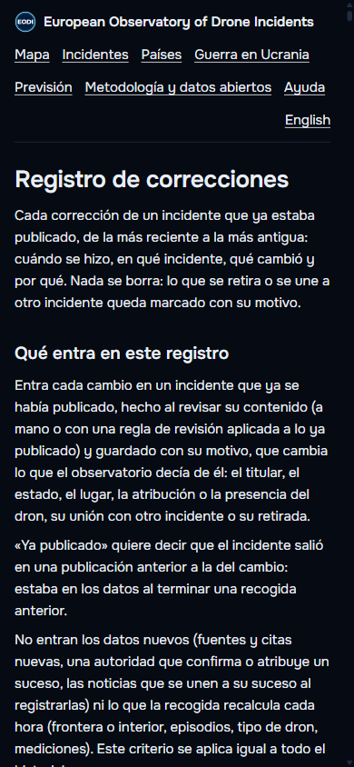
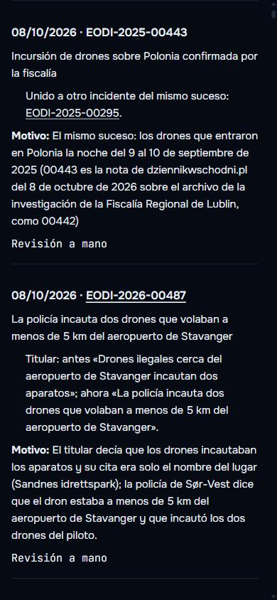
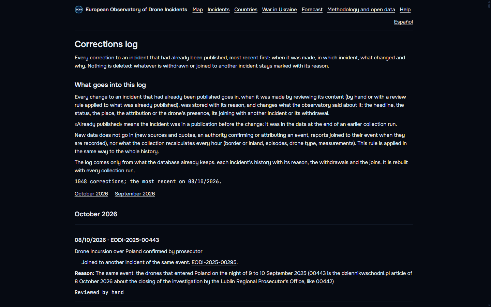

## Bloque 2. Versiones citables de los datos (#181)

**Qué hay.** El día 1 de cada mes se congela una versión de los datos abiertos: los mismos cinco
ficheros que se descargan de la web (incidentes en GeoJSON y CSV, incidentes con lugar aproximado,
ataques de Ucrania en JSON y CSV), tal cual, en el almacén de Hetzner (`versiones/AAAA-MM/`), cada
uno con su huella SHA-256 y la licencia en sus metadatos, más un `metadatos.json` con la fecha, la
hora de los datos que congela, el número de incidentes, el tamaño y la huella de cada fichero, la
licencia CC BY 4.0 y cómo citarla en los dos idiomas.

**Dirección permanente.** `droneobservatory.eu/datos/versiones/2026-10/` (página con los ficheros,
sus huellas, la licencia y la cita; en inglés `/en/data/versions/2026-10`). Los ficheros se sirven
en `droneobservatory.eu/datos/versiones/2026-10/<fichero>` desde el almacén (reescritura en
`vercel.json`). «Metodología y datos abiertos» lista las versiones con la cita lista para copiar
(con un botón «Copiar la cita»; se pide al abrir el panel, no en la primera carga):

> European Observatory of Drone Incidents (2026). Datos abiertos, versión 2026-10.
> droneobservatory.eu/datos/versiones/2026-10/. Licencia CC BY 4.0.

**La primera, ya publicada.** 2026-10, generada el 8 de octubre a las 21:46 UTC con los datos de
las 21:17: 446 incidentes. Comprobado en producción: las cinco descargas desde la dirección
permanente dan exactamente la huella de su `metadatos.json`; los objetos llevan
`x-amz-meta-licencia: CC BY 4.0` y `Cache-Control: immutable`.

**Nunca cambia ni se borra: la regla y la comprobación.** Una versión está publicada cuando está
su `metadatos.json`, que se sube el último. El programa no toca una versión publicada (solo hace
una consulta y sale) y no tiene ninguna orden de borrar; un intento a medias, sin `metadatos.json`,
no cuenta como publicado y se repite entero. Cada día, a las 02:35 UTC, la comprobación mira cada
versión del índice: la huella de su `metadatos.json` contra la del índice y, por cada fichero, su
huella y su etiqueta (ETag) de cuando se publicó, que cambia aunque se vuelva a subir el mismo
contenido; el día 1 baja además todo y recalcula las huellas. Las pruebas lo demuestran: una
versión publicada no se vuelve a subir aunque cambien los datos, y la comprobación detecta un
fichero vuelto a subir, uno cambiado, uno borrado y un `metadatos.json` alterado.

**Automático, con tope, en las copias y en la vigilancia.** `eodi-versiones.timer` (02:35 UTC)
genera la del mes si falta y comprueba todas, con `MemoryMax=1G` (pico medido al generar la
primera: 597 MB; el tope pasó de 400 MB a 1 GB en #183). La segunda copia de Helsinki lleva también
`versiones/`. La vigilancia avisa (problema «versiones» en `salud.json`, incidencia en GitHub) si
pasadas las 06:00 UTC del día 1 no está la del mes, si una publicada cambia o falta, o si no se
comprueban desde hace 2 días.

**DOI.** No se ha hecho: pide una cuenta en un servicio externo de identificadores. Queda en
pendientes, con lo que haría falta.

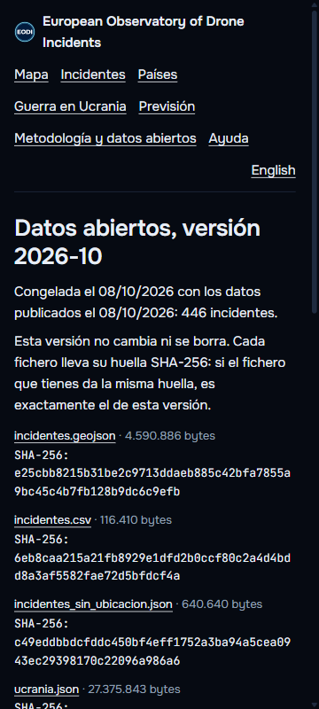
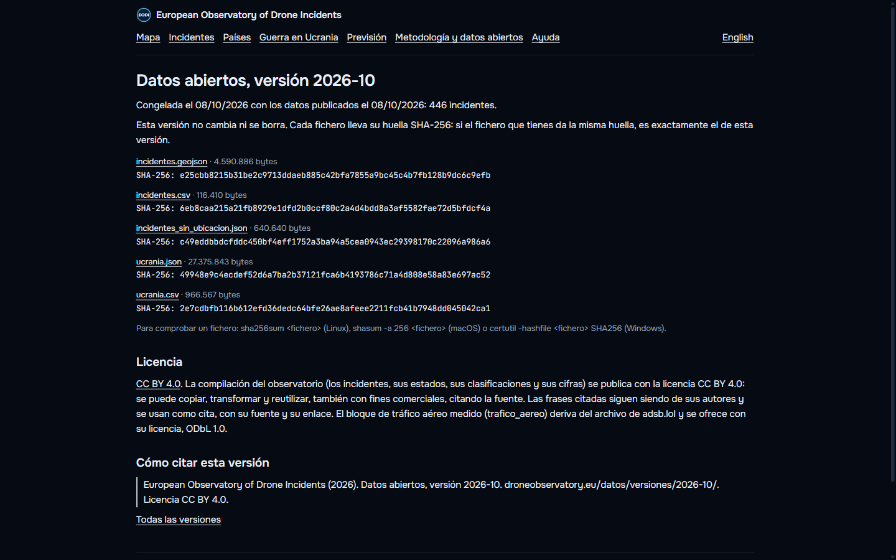
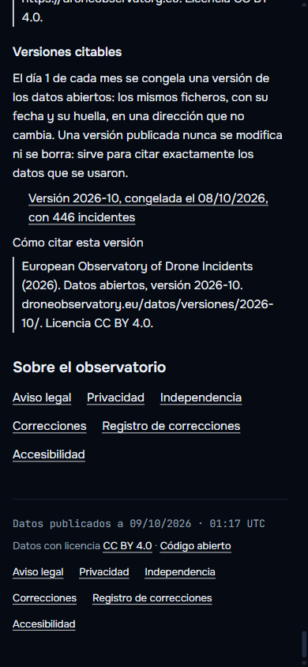

## Bloque 3. Retoques

### 3.1 Accesibilidad de los marcadores (#185)

**Marcadores.** Con la librería del mapa, los incidentes se pintan en el lienzo y no pueden recibir
el foco. Se hizo la alternativa equivalente que ya usaban los corredores: después del mapa, una
lista de botones invisible con los incidentes a la vista (del más reciente al más antiguo; se
rehace al terminar de mover el mapa o al cambiar los filtros). El tabulador la recorre; el lector
de pantalla anuncia el título, el estado y la fecha («Dron sobre la base militar de Sørreisa en
Noruega · Confirmado · 08/10/2026»); el incidente enfocado se señala en el mapa con un aro y su
letrero, e Intro abre su ficha. Con el ratón o el dedo no cambia nada, no aparece nada nuevo y el
mapa no se mueve. Las instrucciones del mapa lo explican. Comprobado en producción en los cuatro
tamaños: 437 incidentes a la vista, el aro y el letrero en su sitio, Intro abre la ficha.

**Contraste de los nombres del mapa de fondo**, medido capa a capa: los principales daban 5,4 a 1
sobre la tierra (cumplen); los tenues (calles, regiones, mares, barrios), 3,1 sobre la tierra y
3,2 sobre el agua (no cumplían). Pasan de `#556277` a `#727f95`: 4,7 sobre la tierra, 4,6 sobre
sus matices y 4,9 sobre el agua, todavía más apagados que los principales. Los nombres de país y
de mar no tenían color de halo: llevan el de la tierra. Una prueba fija (`web/tests/contrasteMapa.test.ts`)
mide cada capa de nombres contra su halo y contra la tierra, sus matices y el agua; con el color
antiguo falla.

**Declaración de accesibilidad al día**: los marcadores y el contraste pasan a «Lo que cumple»; queda
pendiente la capa de la guerra en Ucrania (regiones, impactos y celdas de GPS, que no se recorren
uno a uno con el teclado; sus datos están en la página de texto de la guerra), con su arreglo y una
fecha propuesta (31 de diciembre de 2026).

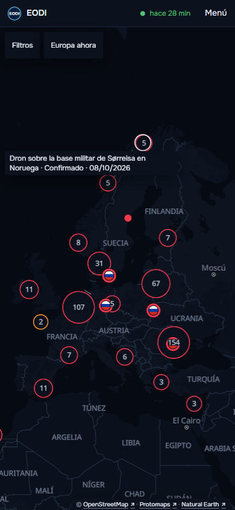
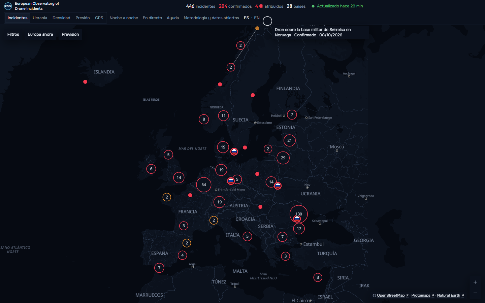
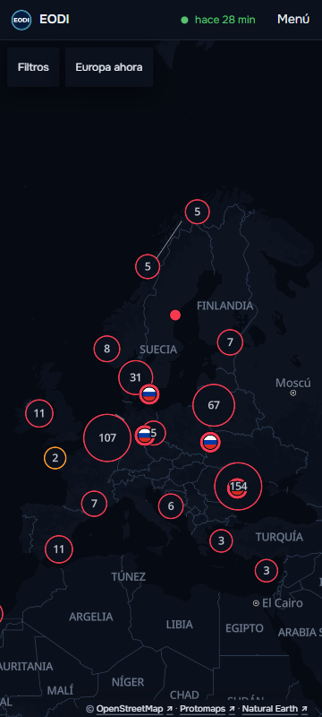

### 3.2 Nombres de lugar sin traducir (#182)

La ficha de Bulgaria (EODI-2026-00489) enseñaba «exclusive economic zone», que es como el extractor
guardó el objetivo leyendo una fuente inglesa. Revisados todos los nombres de lugar publicados
(objetivo, localidad, región y otros lugares de 446 incidentes), el mismo fallo salía en:

- descripciones en la lengua de la fuente: «gare de triage de Mulhouse», «Nato-kaia», «eastern
  Latvia», «northern Latvia», «southeastern Lithuania», «southeast», «nord»;
- nombres en otra escritura: «Васил Левски» (el aeropuerto de Sofía), «София», «Варна»,
  «Αιγαίο», «Βορειοανατολικό και Κεντρικό Αιγαίο»;
- el nombre inglés de ciudades que en español tienen el suyo: Warsaw, Copenhagen, Gothenburg,
  Chisinau, Berlin, Hamburg, Vilnius, Dublin, Sofia (y Sevilla en la versión inglesa).

Se escriben en los dos idiomas en `web/src/i18n/nombresLugar.ts`. Lo que llegue nuevo y no esté en
la tabla: en cirílico o en griego se pasa al alfabeto latino, y si es una descripción (empieza por
minúscula) no se enseña (quedan el país y el titular). Los nombres propios se dejan como los
escribe la fuente («Portul Constanța», «Brussels Airport»); el CSV conserva el dato original. Lo
usan la ficha, las páginas de texto y el lugar aproximado. Una prueba lo comprueba también con los
datos publicados en la integración continua. En producción: «Zona económica exclusiva» en español
y «Exclusive economic zone» en inglés.

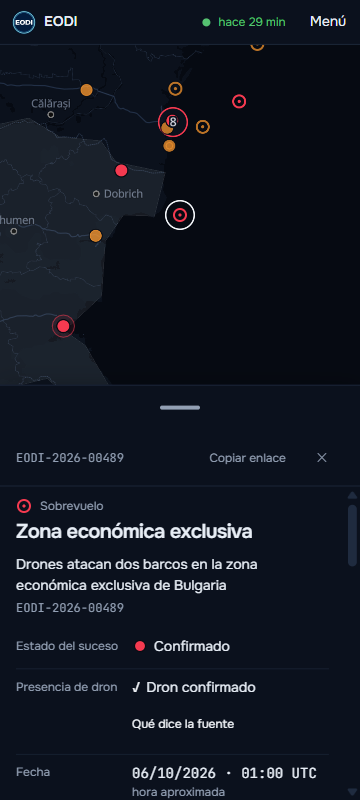
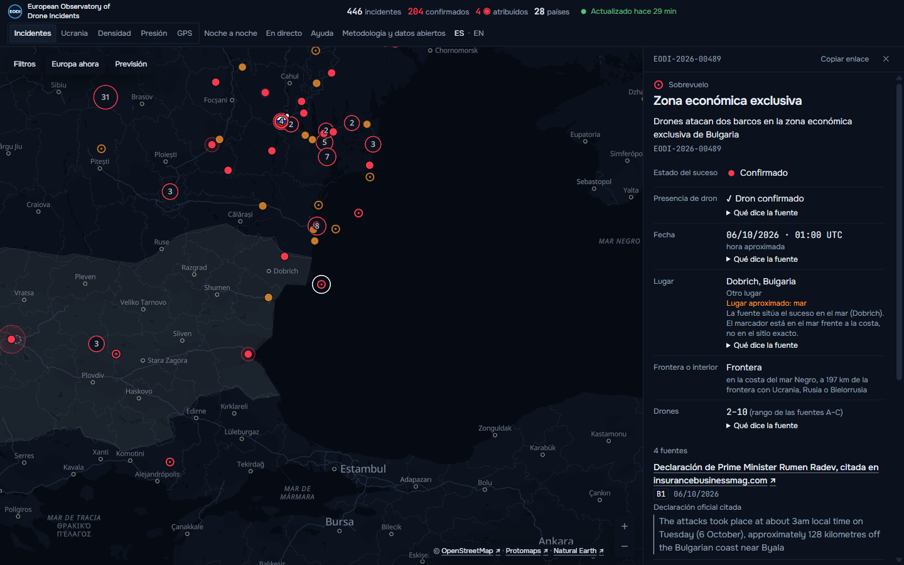

### 3.3 Licencia en el almacén (#183)

Los ficheros públicos del almacén (`publicacion/incidentes.geojson`, `incidentes_sin_ubicacion.json`,
`ucrania.json`, `prevision.json` y `correcciones.json`, y su instantánea diaria) suben ahora con la
licencia dentro: el miembro `licencia` al principio del JSON, igual que en las descargas de la web
(nombre, enlace, titular, alcance y cita en los dos idiomas), y `x-amz-meta-licencia` en los
metadatos del objeto. El texto está una sola vez, en `configuracion/licencia_datos.json`, y lo usan
también las versiones citables. Los ficheros de la carpeta del servidor y sus esquemas no
cambian; el manifiesto lleva la huella de lo subido. La web acepta la licencia y, en las
descargas, pone la suya (con la fecha de la versión), sin duplicarla.

### 3.4 Notas nuevas sobre sucesos antiguos (#184)

**Por qué no se unían.** La nota del archivo de la investigación de los drones de Polonia
(EODI-2025-00442 y 00443) traía el día del suceso escrito («10 września») pero solo el país; el
incidente (EODI-2025-00295) tiene punto (Cześniki). La regla de «mismo sitio» exigía que los dos
tuvieran punto o que ninguno lo tuviera.

**La regla nueva** (`proceso/incidentes.py`): una nota posterior (el día del suceso lo escribe la
fuente y la primera noticia sale al menos 2 días después) se une sola al incidente registrado del
mismo país, del mismo tipo y del mismo día, si la nota no da otro sitio (sin punto y, si las dos la
dicen, la misma región; o con punto en el mismo sitio) y no son cierres de noches distintas. Solo si
hay un único candidato: si ese día hubo dos sucesos en el país, no se une a ninguno. La fusión
queda anotada con su motivo, no la deshace la revisión de fusiones y sale en el registro de
correcciones si unió algo ya publicado.

**Comprobada con la base real** (copia del 8 de octubre a las 18:31 UTC):

- contra las 70 uniones hechas a mano: la regla de siempre ya hacía 5 y la nueva hace otras 3
  (entre ellas las notas del archivo de la investigación de Lublin). Las otras 62 no las puede
  hacer una regla sin riesgo: 36 son notas fechadas por su publicación (no escriben el día del
  suceso: no hay fecha que comparar), 22 son duplicados publicados el mismo día del suceso (no son
  notas posteriores: el mismo día hay sucesos distintos que solo se separan leyéndolos, como los de
  Moldavia del 3 de octubre de 2026), 3 tienen otro tipo y 1 otro día. Probé a aceptar
  incursión y sobrevuelo como el mismo tipo: no recupera ninguna unión más y crea dudas;
- contra los incidentes distintos: sobre todos los activos, la regla uniría solo 4 pares,
  revisados uno a uno y todos el mismo suceso publicado dos veces (los globos del aeropuerto de
  Vilna del 4 de octubre de 2025, Pardina del 13 de septiembre de 2025, Kouvola del 29 de marzo de
  2026 y el puerto de Constanza del 5 de junio de 2026). Los pares distintos conocidos del mismo
  lugar siguen separados (pruebas en `tests/test_notas_posteriores.py`): Moldavia mañana y tarde
  del 7 de octubre de 2026, los aeropuertos de Lublin y Rzeszów de la misma noche, Leipzig/Halle y
  Wunstorf, y los cierres de Lieja de dos noches seguidas;
- ensayo completo de recogida y exportación con código 0. El ensayo no lleva las claves del
  extractor y no pasa por la fusión; por eso la fusión se ensayó aparte sobre una copia de la base
  real: 4 uniones, las de arriba.

## Comprobación en producción

- **Recorrido en producción**, con un navegador de verdad, en 360 × 800, 390 × 844, 412 × 915 y
  escritorio: portada, recorrido con el teclado, ficha de Bulgaria, registro de correcciones (en
  español y en inglés), página de la versión 2026-10 y «Metodología y datos abiertos» con la lista
  de versiones y la cita. Ninguna página se sale de la pantalla a lo ancho. El navegador
  automático sin interfaz dejó de servir a mitad (Vercel puso este equipo en «comprobación de
  navegador» tras muchas peticiones seguidas, como ya pasó en sesiones anteriores); las capturas se
  hicieron con el navegador normal. En el teléfono, la tabla de la página de la versión partía las
  cifras: pasó a ser una lista (#185).
- **Primera carga** (`web/scripts/medir-carga.ts`, mediana de 7, caché vacía): antes (8 de octubre,
  21:26 UTC) escritorio 308 ms de primera pintura y 2.039 ms hasta el mapa listo, móvil 324 ms y
  2.870 ms; después (9 de octubre, 02:14 UTC) escritorio 268 ms y 1.588 ms, móvil 308 ms y
  2.900 ms. Igual, dentro del ruido. El HTML de la portada pasa de 87,8 a 88,6 KB (el enlace al
  registro en el pie del texto). La lista de teclado se pinta después de que el mapa está listo y
  la lista de versiones se pide al abrir la metodología.
- **Recogidas tras las fusiones**: tras #180 y #181, las de las 22:17, 23:17 y 00:17 terminaron
  bien y publicaron (la de las 22:17, el primer `correcciones.json`). Tras #183 y #184, la de las
  02:17 terminó bien y publicó con la licencia dentro de cada fichero e hizo las 4 uniones de
  duplicados previstas (`fusiones=4`), que salen en el registro con su motivo (1.052
  correcciones); la de las 03:17 también terminó bien y publicó.
- **Incidentes publicados**: de 446 a 442 tras la recogida de las 02:17. Son exactamente los 4
  duplicados unidos por la regla nueva (EODI-2025-00102 en 00112, 2025-00257 en 2025-00306,
  2026-00284 en 00180 y 2026-00396 en 00410), revisados uno a uno antes de fusionar; sus
  direcciones llevan a su incidente. No es una pérdida de datos, que es lo que vigila el paso h de
  `docs/fusiones.md`, sino el efecto pedido del bloque 3.4; revertir #184 tampoco los separaría.
- **Vigilancia**: `salud.json` sin problemas ni avisos; la unidad `eodi-versiones` pasó a las
  02:35 («2026-10: ya_publicada», sin subir nada) y comprobó la versión.

## Pendientes, con su arreglo

1. **DOI de las versiones.** No se ha hecho: pide una cuenta en un servicio externo que asigne
   identificadores a conjuntos de datos. Lo que haría falta: la cuenta y un prefijo propio; por
   cada versión, depositar sus metadatos (título, autor, fecha, licencia, dirección permanente y
   huellas: `metadatos.json` ya lo tiene todo), y añadir el DOI a la cita y a la página de la
   versión. Las versiones ya publicadas pueden recibirlo después sin cambiar.
2. **Accesibilidad: capa de la guerra en Ucrania.** Las regiones, los impactos y las celdas de GPS
   no se recorren uno a uno con el teclado (los corredores y los incidentes sí). Arreglo: la misma
   lista de teclado que los incidentes. Fecha propuesta en la declaración: 31 de diciembre de 2026
   (se cambia en `web/src/texto/servicio.ts`).
3. **Notas fechadas por su publicación.** Una nota que vuelve sobre un suceso sin escribir su día
   (como 36 de las 70 uniones a mano) no la puede unir una regla sin riesgo de juntar sucesos
   distintos. Arreglo: como hasta ahora, unirla en `configuracion/incidentes_revisados.json` cuando
   la vigilancia la señale («titulares_retenidos» en `salud.json`); la unión saldrá sola en el
   registro de correcciones.
4. **Comprobación de las versiones en el propio almacén.** La regla está en el programa y la
   comprobación diaria avisa de cualquier cambio, pero con las credenciales del almacén un objeto
   de `versiones/` se podría sobrescribir a mano. Arreglo, si se quiere un candado más: un bucket
   aparte para las versiones con bloqueo de objetos (Object Lock en modo de cumplimiento), que se
   tendría que crear vacío y no admite volver atrás.

## 9 de octubre de 2026: tres arreglos (#187, #188 y #189)

### Fuera el registro de correcciones (#187)

Se retira la página «Registro de correcciones» / «Corrections log» en los dos idiomas, con su
página de texto, y todos los enlaces a ella (página de correcciones, metodología, pie de las
páginas de texto, `sitemap.xml` y `llms.txt`). Las fichas y sus páginas de texto ya no tienen la
línea «Corregido el». Deja de generarse y de publicarse `correcciones.json`
(`exportacion/correcciones.py`, su configuración y sus pruebas, fuera; el fichero, retirado del
almacén público). La página «Correcciones» se queda solo con la frase de a qué correo escribir, así
que esa frase pasa al aviso legal y la página también se retira. `/correcciones`,
`/correcciones/registro`, `/en/corrections`, `/en/corrections/log` y `/datos/correcciones.json`
dan un 404 real. La base no se toca: el historial de cada incidente sigue en ella; solo deja de
publicarse en la web. El punto 3 de los pendientes de arriba ya no aplica en su última frase: la
unión no sale en ningún registro público.

### Fuera el filtro de tipo de dron (#188)

«Filtros» ya no tiene el grupo de tipo de dron, en los dos idiomas, y la dirección ya no lleva
`?dron=`: un enlace antiguo con ese parámetro abre la web normal, sin filtro. La fila «Tipo de
dron» de las fichas sigue igual: los 6 incidentes identificados por la autoridad (EODI-2025-00261,
2025-00295, 2026-00098, 2026-00171, 2026-00211 y 2026-00300) con su modelo y su cita, y los 70
«Compatible con un dron de largo alcance de la guerra», con su razón; comprobado en las fichas y en
las páginas de texto en español e inglés. El campo `dron` sigue en `resumen.json` para que una
pestaña abierta con la versión anterior lo siga leyendo.

### «Previsión» siempre carga (#189)

**Causa del fallo de las 07:50 (hora de Madrid).** La pestaña que falló estaba abierta desde las
22:50 del 8 de octubre con la versión de la web anterior a #183. Desde la recogida de las 04:17,
`prevision.json` lleva dentro su licencia (#183), y aquella versión validaba los datos de forma
cerrada: cualquier campo que no conociera invalidaba el fichero. Pruebas: las métricas de Vercel
muestran la petición de `prevision.json` a las 07:49:43 servida con 200 (sin error del servidor,
sin despliegue en ese momento y sin pasar por el almacén); el validador de esa versión, ejecutado
contra el fichero publicado, da «.licencia: campo desconocido»; y al recargar la página a las 07:50
y a las 07:55, con el código nuevo, cargó.

**Qué cambia.**
- En el navegador, un campo nuevo en los datos ya no invalida un fichero; lo que falta o está mal,
  sí. En el build, la validación sigue cerrada.
- Cada descarga bajo demanda reintenta hasta cinco veces, con esperas de 0,5, 1, 2 y 4 segundos,
  ante errores del servidor, cortes de la red o un fichero que llega a medias, y sin la caché del
  navegador desde el segundo intento. Lo que no existe (404) no se reintenta. Vale para la
  previsión, las capas del mapa (teselas, fronteras, datos y tipografías), las fichas, «Europa
  ahora», «Noche a noche», las rutas, la guerra por satélite y la metodología.
- Si la previsión de la web no llega, se pide la copia del almacén público. Si tampoco, se enseña
  la última que hubo, con la fecha en que se calculó y «Reintentar».
- Un error que llega a verse dice qué ha pasado (sin respuesta o una versión nueva de la web) y
  tiene «Reintentar», en los dos idiomas.
- En el servidor, cada fichero se escribe en un temporal y se renombra (`escribir_atomico`), así
  que nadie puede leer un fichero a medio escribir. El índice de las rutas solo se sube si se
  subieron todas sus noches. El almacén ya subía el manifiesto el último.
- Prueba en el navegador (`web/e2e/prevision-reintentos.spec.ts`, en la integración continua): el
  fichero de la previsión falla dos veces (un 503 y un corte de la conexión) y la previsión se ve
  sin ningún error; si no responde nunca, sale el error y «Reintentar» la trae cuando vuelve.

**Segunda causa, vista al comprobar durante una publicación (#190).** Cada recogida con cambios
pide a Vercel una reconstrucción, y en cada una cambia el nombre del código de la página (07:40
`app-CHK-PXVt.js`, 08:33 `app-cCKpW1Qr.js`, 09:33 `app-CS4QoUl5.js`). El despliegue de las 09:33
quedó listo a las 09:34:02; a las 09:34:05 una ventana nueva recibió ya la página nueva, y la
petición de su código llegó aún al despliegue anterior (dpl_13b1…, el de las 08:33), que no lo
tiene: 404, según las métricas de Vercel (la única respuesta fallida entre las 09:33 y las 09:36).
La página se quedaba con la cabecera y sin mapa, sin aviso y sin poder abrir «Previsión». Arreglo:
`web/public/arranque.js`, un fichero sin huella (el mismo en todos los despliegues) que se carga
antes que el código. Si el código o el estilo no llegan, una hoja de estilo se vuelve a pedir sin
la caché del navegador y un módulo hace recargar la página, con esperas de 0,5, 1, 2 y 4 segundos
(el navegador recuerda el fallo de un módulo mientras dure la página: volver a pedirlo no
basta). Lo mismo si no llega el código del mapa, que se pide aparte. Tras la cuarta espera lo
dice, en el idioma de la página, con «Reintentar». Prueba en el navegador
(`web/e2e/arranque-reintentos.spec.ts`, en la integración continua): el código de la página falla
dos veces (un 404 y un corte) y el del mapa una, y la web arranca sola y abre «Previsión»; si no
llega nunca, recarga cuatro veces, avisa y «Reintentar» la trae.

### Comprobación

- **Antes de fusionar**: #187 y #189, ensayo completo de recogida y exportación sobre una copia de
  la base real, con código 0; las cuatro PR, con las comprobaciones en verde; #190 no toca la recogida ni los datos.
- **Recogidas tras las fusiones**: la de las 07:17 (tras #187 y #188) y la de las 08:17 (tras
  #189) terminaron bien y publicaron `ucrania.json`, `prevision.json` y el manifiesto, ya sin
  `correcciones.json`. La de las 09:17 terminó bien y publicó (`incidentes.geojson`, `ucrania.json`,
  `prevision.json` y el manifiesto).
- **En producción**, en una ventana limpia, a 390×844 y en escritorio (y el tipo de dron también a
  360×800 y 412×915), revisando las capturas una a una:
  - ninguna mención ni enlace al registro, ni «Corregido el», en la portada, las fichas y las
    páginas de texto en los dos idiomas; las cinco direcciones antiguas dan 404, y el aviso legal
    tiene la frase del correo;
  - «Filtros» sin tipo de dron, también desde un enlace con `?dron=`; la ficha de EODI-2026-00211
    (Geran-2, según la autoridad, con su cita) y la de un «Compatible con…» (con su razón);
  - «Previsión» abrió bien 10 veces seguidas en cada tamaño, cada vez en una ventana nueva. Durante
    la publicación de las 09:17, en rondas seguidas de 10 y 10 de las 09:17 a las 09:35, abrió
    bien 475 veces; una vez, a las 09:34:05, la web no arrancó: es la segunda causa, arriba,
    arreglada en #190. Con #190 en producción, durante la publicación de las 10:17 (que terminó
    bien y publicó), «Previsión» abrió bien 400 veces en rondas de 10:17 a 10:31, y 186 ventanas
    nuevas seguidas, de 10:31 a 10:37, cubrieron el cambio de despliegue: todas arrancaron y
    abrieron «Previsión». Una, a las 10:34:12, cayó justo en el cambio (404 en el código y en el
    estado de la página): se recargó sola y abrió con el despliegue nuevo;
  - la prueba de fallos pasajeros, contra producción, pasó en los dos tamaños.
- **Incidentes publicados**: 442 antes y después.
