# Revisión final del European Observatory of Drone Incidents

8 de octubre de 2026. Esta revisión no añade funciones: arregla lo encontrado, completa lo que un
servicio público necesita y recorre la web entera como un usuario nuevo. Seis bloques, en orden.
Todo entró por PR con las comprobaciones en verde, fusionado con `gh pr merge --rebase` fuera de los
minutos 12 a 40.

| PR | Bloque | Qué | Fusionado (UTC) |
| --- | --- | --- | --- |
| #171 | 1 | Previsión más limpia | 13:52 |
| #172 | 4 | El nombre del prefecto fuera de los ficheros actuales | 13:56 |
| #174 | 2 | Marcador de lugar aproximado | 14:04 |
| #173 | 3 | Los tres titulares retenidos | 14:41 |
| #175 | 5 | Páginas de servicio público y licencia | 14:46 |
| #176 | 6 | Zoom del lugar aproximado | 14:50 |
| #177 | 6 | Etiqueta de la descarga de lugar aproximado | 14:58 |
| #178 | 5 y 3 | Este informe, botón «Borrar mi última visita» y unión de EODI-2025-00443 | 16:41 |

## Bloque 1. «Previsión», más limpia (#171)

- **«La semana que viene» ya no se ve**: ni en el panel, ni en la página de texto
  (`/prevision`, `/en/forecast`), ni en su descripción (la que leen buscadores y llms.txt), ni en
  la metodología. Su cálculo sigue en el servidor y en `prevision.json`.
- **«Esta noche en la frontera»**:
  - solo se listan los factores que suben o bajan el riesgo; si ninguno lo hace, lo dice en una
    línea;
  - una sola cifra de «lo habitual», la misma de la comprobación: noches con dron entre noches
    comprobadas. Rumanía pasa de «9 de cada 100» a **12 de cada 100** (56 de 462) y Moldavia de 6
    a **7 de cada 100** (33 de 462), que es lo que dice la comprobación;
  - en lugar de «acierta un 10 % más que la frecuencia de siempre», la comprobación dice: «Hubo
    dron en 56 (12 de cada 100, lo habitual). De las 56 noches con dron, 39 estaban entre la
    cuarta parte de noches con más riesgo».
- **«Rachas por país»**: fuera la línea «Han vuelto a lo normal».
- **«Qué ha cambiado»** sigue igual.
- **Todos los párrafos «Comprobado con…»** (frontera, previsiones en vivo, rachas y qué ha
  cambiado) van plegados tras «Cómo se comprueba», que se abre al tocarlo. A la vista, el número y
  sus razones. La página de texto dice lo mismo, con el mismo desplegable.
- Prueba nueva en `web/tests/prevision.test.tsx` (sin semana, sin «no lo cambia», lo habitual igual
  a la comprobación, lo comprobado plegado).

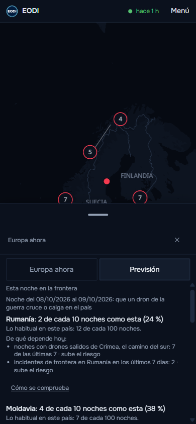

## Bloque 2. Incidentes sin punto en el mapa (#174, #176)

Antes, 117 de los 443 incidentes publicados no tenían punto y no se dibujaban. Por eso «Novedades»
enseñaba incidentes de las últimas 24 horas (Moldavia, Bulgaria) que el mapa con el filtro de 24
horas no tenía.

- **Marcador de lugar aproximado**: un aro hueco del color de su estado con un punto en el centro.
  Distinto del círculo relleno (lugar conocido) y del gris discontinuo de «desmentido». Va en el
  centro de la zona que nombra la fuente: el país (el punto de etiqueta de Natural Earth, el mismo
  con que se rotula el país), la región (tabla de las regiones que nombran las fuentes, en
  `web/src/datos/lugarAproximado.ts`) o el mar frente a la costa si el titular dice que fue en el
  mar («zona económica exclusiva», «barcos», «mar Negro»…). Se agrupa como los demás. No dibuja
  área ni línea de episodio. Una región que no está en la tabla deja el marcador en el país.
- **La ficha** dice «Lugar aproximado: país / región / mar» y de dónde sale («La fuente sitúa el
  suceso en el mar (Dobrich). El marcador está en el mar frente a la costa, no en el sitio
  exacto»), en los dos idiomas. Lo mismo la página de texto de cada uno de esos incidentes.
- **Al abrir uno** el mapa va a zoom 6 (país y mar) o 6,5 (región), por encima del zoom hasta el que
  se agrupan los incidentes, para que su marcador se vea (#176; en el recorrido se vio que a zoom
  4,5 quedaba dentro de un grupo).
- **Contadores y filtros** cuentan todos los incidentes (ya lo hacían); ahora todos se ven.
- **«Novedades»** dice qué mide cada hora: «registrado hace 19 h», y debajo del titular «ocurrió el
  07/10/2026».
- **Fechado solo por día**: entra en «últimas 24 h» si su día toca las 24 horas (hoy o ayer). Ya era
  así; ahora lo fija una prueba.
- **Prueba fija** `web/tests/aproximados.test.ts`, que la integración continua pasa también con los
  datos publicados: todo incidente tiene sitio en el mapa, toda novedad de las últimas 24 horas sale
  con el filtro de 24 horas (también las de lugar aproximado), y el criterio del día.
- La lista, el selector de una pila, «Novedades», la ayuda y la metodología usan el mismo símbolo y
  lo explican.

**En producción**, con el filtro de 24 horas (14:20 UTC): 5 en «Novedades», 5 en la cabecera y 5 en
el mapa, entre ellos el del Egeo y EODI-2026-00492 (Moldavia, espacio aéreo, lugar aproximado: país).
EODI-2026-00489 (Bulgaria, zona económica exclusiva, 6 de octubre a la 01:00 UTC) sale en el mar
frente a Dobrich con el filtro de 7 días; con el de 24 horas ya no entra, porque ocurrió hace más de
24 horas (lo registró el observatorio el día 7, y eso es lo que decía «hace N h» en «Novedades»).

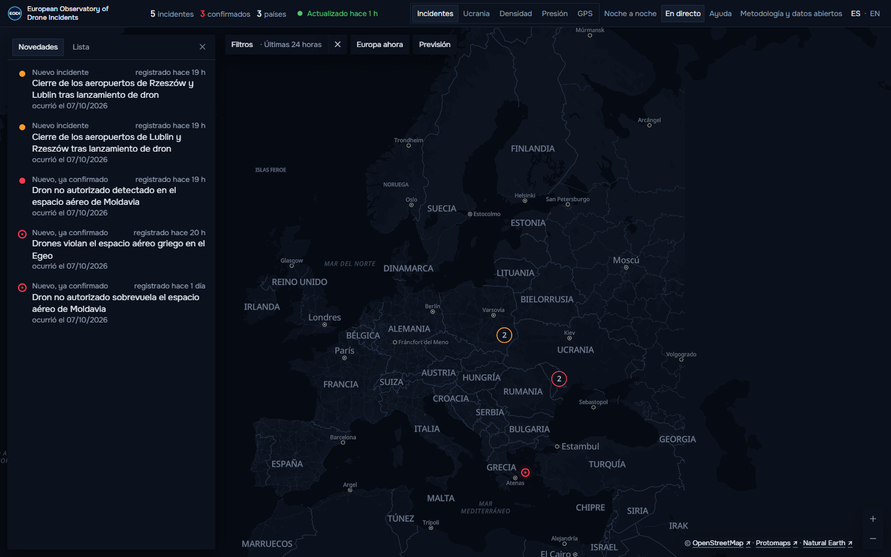
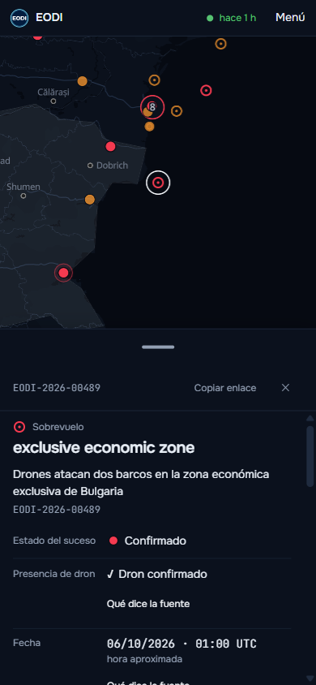
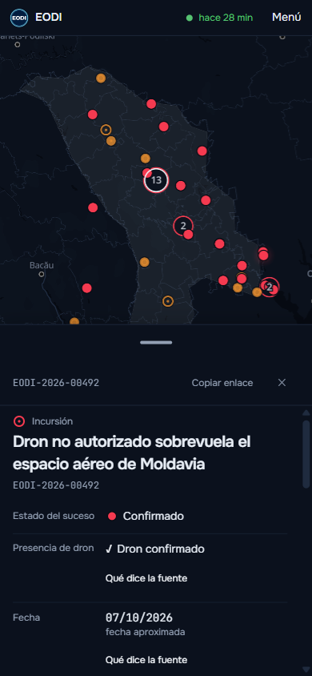

## Bloque 3. Titulares retenidos (#173)

La barrera retenía EODI-2026-00486 y EODI-2026-00487 y, desde la recogida de las 13:17 de hoy,
EODI-2025-00442. Uno por uno:

- **EODI-2026-00486 (Fairford, Reino Unido) — no era un suceso con dron.** Sus dos fuentes (un
  agregador y el Daily Mail, 6-7 de octubre) cuentan un supuesto plan para atacar la base con
  drones, las detenciones cerca de la base y la retirada preventiva de los bombarderos
  estadounidenses. Ningún dron se vio ni voló. Se retira con su motivo en español y en inglés.
- **EODI-2026-00487 (Sandnes, Noruega) — el titular afirmaba de más.** Decía «Drones ilegales cerca
  del aeropuerto de Stavanger incautan dos aparatos» y su única cita era el nombre del lugar
  («Sandnes idrettspark»). Se guardan las dos frases de la policía de Sør-Vest en Sandnesposten
  (el dron estaba a menos de 5 km del aeropuerto de Stavanger; incautados los dos drones del
  piloto) y el titular pasa a «La policía incauta dos drones que volaban a menos de 5 km del
  aeropuerto de Stavanger».
- **EODI-2025-00442 (Polonia) — duplicado.** Una nota de bankier.pl del 8 de octubre de 2026 sobre el
  archivo de la investigación de la Fiscalía de Lublin por los drones de la noche del 9 al 10 de
  septiembre de 2025. Es el mismo suceso que EODI-2025-00295 y se une a él.

Nada se borra: las tres correcciones van en `configuracion/incidentes_revisados.json` y las aplica
la recogida. El ensayo completo de recogida y exportación sobre una copia de la base real terminó con
código 0, la exportación semanal generada y ningún aviso de la barrera («revisión del contenido:
retirados 1, con citas 1, titulares 1»). Una prueba de la configuración exigía que toda cita
revisada tuviera fecha de comprobación 5 de octubre; ahora acepta esa fecha o una posterior.

**La recogida de las 15:17**, la primera con la revisión, terminó con código 0 y publicó: 444
incidentes (uno más: EODI-2026-00487 con su titular nuevo; 00486 retirado y 2025-00442 unido no
se publicaban). Pero la barrera retuvo uno nuevo, creado en esa misma recogida:
**EODI-2025-00443**, otra nota del 8 de octubre (dziennikwschodni.pl) sobre el mismo archivo de la
investigación de los drones del 9 al 10 de septiembre de 2025. Se une también a EODI-2025-00295
(#178). Su ensayo completo dio código 2 la primera vez, por el tope de 240 s de las fuentes oficiales (cinco sin leer, un aviso pasajero ajeno al cambio), y código 0 la segunda, con la exportación semanal generada, la unión aplicada y ningún aviso de la barrera. La noticia del archivo puede seguir apareciendo en más medios
estos días: queda como pendiente, con su arreglo, al final.

## Bloque 4. Un nombre que sobra (#172)

El nombre del prefecto de Iasi, guardado por error como autor de EODI-2026-00015, salía en tres
ficheros actuales: el informe del marcador de atribuidos (ahora «el propio prefecto de Iasi», sin
el enlace que llevaba el nombre en la dirección), las pruebas de la atribución (un nombre inventado
con el mismo papel) y la prueba de navegador de los atribuidos (ahora comprueba que la ficha de un
incidente retirado no tiene autor). No está en los datos publicados (incidentes, sin ubicación,
Ucrania, previsión) ni, por tanto, en las páginas de texto. El historial de git no se ha tocado.

## Bloque 5. Lo que necesita un servicio público (#175, #177)

Cinco páginas de texto nuevas, en español y en inglés, enlazadas desde «Metodología y datos
abiertos» (en la web y en su página de texto) y desde el pie de todas las páginas de texto; nunca
desde la pantalla del mapa. Van en el sitemap y en llms.txt.

| Página | Español | Inglés |
| --- | --- | --- |
| Aviso legal | `/aviso-legal` | `/en/legal-notice` |
| Privacidad | `/privacidad` | `/en/privacy` |
| Independencia, autoría y financiación | `/independencia` | `/en/independence` |
| Correcciones | `/correcciones` | `/en/corrections` |
| Declaración de accesibilidad | `/accesibilidad` | `/en/accessibility` |

- **Aviso legal**: responsable (Lucas Alaniz Pintos, persona física), contacto, qué es, proyecto
  independiente y sin ánimo de lucro, no representa a ningún gobierno ni organismo, no es un sistema
  de alerta, cómo se usan los datos y que la información se ofrece tal cual, con su fuente y su fecha.
- **Privacidad**, comprobada en el código, en `vercel.json` y en la configuración de los proveedores:
  - ninguna cookie propia; ninguna analítica ni publicidad. La analítica del alojamiento existe en el
    proyecto pero no está activada y la web no carga su script; la política de seguridad de la web
    solo deja hablar con la propia web y con el almacén de datos (letras, banderas y mapa se sirven
    desde ahí);
  - un solo dato en el navegador: `eodi.ultima-visita`, la fecha y la hora de la última visita al
    mapa, en el almacenamiento local. **Decisión del dueño: se mantiene, sin aviso de
    consentimiento ni banner** (#178). La página dice qué guarda, para qué sirve (marcar lo nuevo y
    contar las novedades en «Europa ahora»), que solo está en el navegador, que no se envía a
    ningún servidor ni a terceros, que no identifica a nadie y cuánto dura (hasta que se borra; cada
    visita al mapa la sustituye). Lleva el botón **«Borrar mi última visita»** («Delete my last
    visit»), que la borra en el momento y lo confirma («Hecho: se ha borrado…»). Su script es un
    fichero de la propia web (`/borrar-visita.js`) que solo carga la página de privacidad; sin
    código, el botón no se ve y la página explica cómo borrarla desde el navegador. Nada cambia en
    la pantalla del mapa;
  - registros técnicos del alojamiento de la web y del almacén (IP, dirección pedida, navegador),
    que el observatorio no usa ni guarda; el almacén no permite activar registros de acceso;
  - si el alojamiento ve tráfico anómalo puede pedir una comprobación automática y guardar una cookie
    técnica de seguridad (no necesita consentimiento);
  - el correo, solo para responder; derechos y a quién dirigirse.
- **Licencia de los datos abiertos**: CC BY 4.0 para la compilación (incidentes, estados,
  clasificaciones y cifras), con la forma de citar; las citas siguen siendo de sus autores y se usan
  como cita con su fuente. Está en la página de datos abiertos, en cada JSON descargable (miembro
  `licencia` al principio, con nombre, enlace, alcance y cita en los dos idiomas), en los CSV por la
  cabecera HTTP `Link: <…/by/4.0/>; rel="license"` de `/datos` y en llms.txt («How to cite» y
  «Cómo citar»).
- **Fuentes y licencias**: ninguna fuente que se publica exige una licencia incompatible. La única con
  otra licencia es el bloque de tráfico aéreo medido (`trafico_aereo`), que deriva de adsb.lol (ODbL
  1.0, que obliga a compartir igual): ya iba aparte en `LICENSE-DATOS` y ahora lo dicen también la
  página de datos abiertos, los ficheros y llms.txt. Las imágenes de Sentinel llevan su mención de
  Copernicus en la ficha. NEPTUN (que pide un enlace visible) y EUROCONTROL (sin fines comerciales) no
  se publican; Open-Meteo solo alimenta datos internos.
- **Independencia, autoría y financiación**: quién lo hace, medios propios, sin publicidad ni
  financiación de terceros, sin pagos por incluir o retirar datos, y el criterio editorial en cuatro
  líneas.
- **Correcciones**: escribir al correo con el identificador del incidente y, si se puede, la fuente.
- **Accesibilidad (WCAG 2.1 AA)**: revisión automática (axe) de la portada, una ficha, los filtros,
  «Europa ahora», «Previsión», el menú, la ayuda y las páginas de texto, en teléfono y escritorio:
  **ningún fallo**. Recorrido con el teclado: enlace para saltar al mapa, foco visible en cada
  control, Escape cierra los paneles y devuelve el foco al botón que los abrió. Los colores ya tienen
  prueba de contraste AA. No hizo falta cambiar nada del diseño. La declaración dice lo que cumple y
  lo pendiente con su fecha prevista (abajo).

**Sin la fecha de la última visita**, comprobado en producción en el teléfono: en la primera
visita no hay línea de novedades ni número en «Europa ahora»; con una visita anterior del 6 de
octubre salen «10 novedades desde tu última visita»; tras borrarla, otra vez nada. Lo fija además
una prueba que ejecuta el script del botón y comprueba que borra solo esa clave y que la visita
siguiente no marca nada como nuevo.

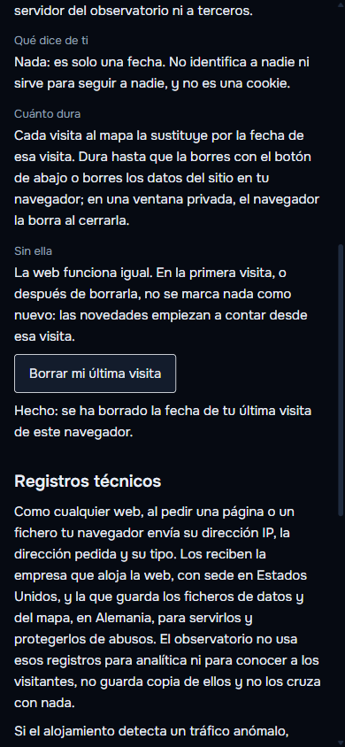
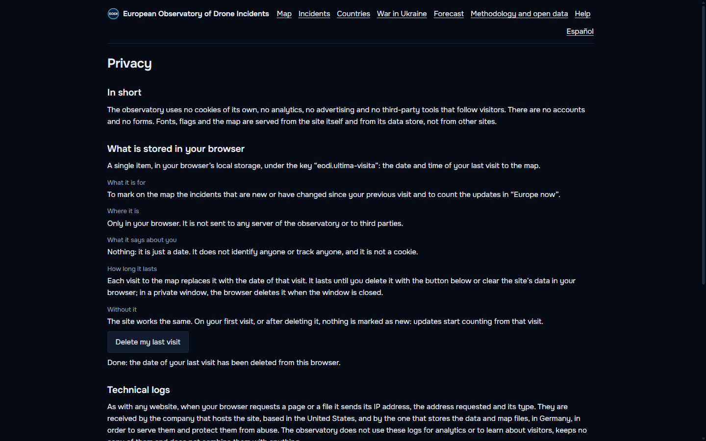
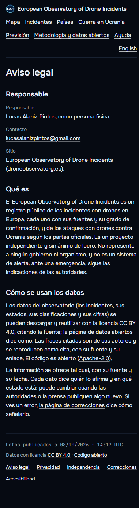
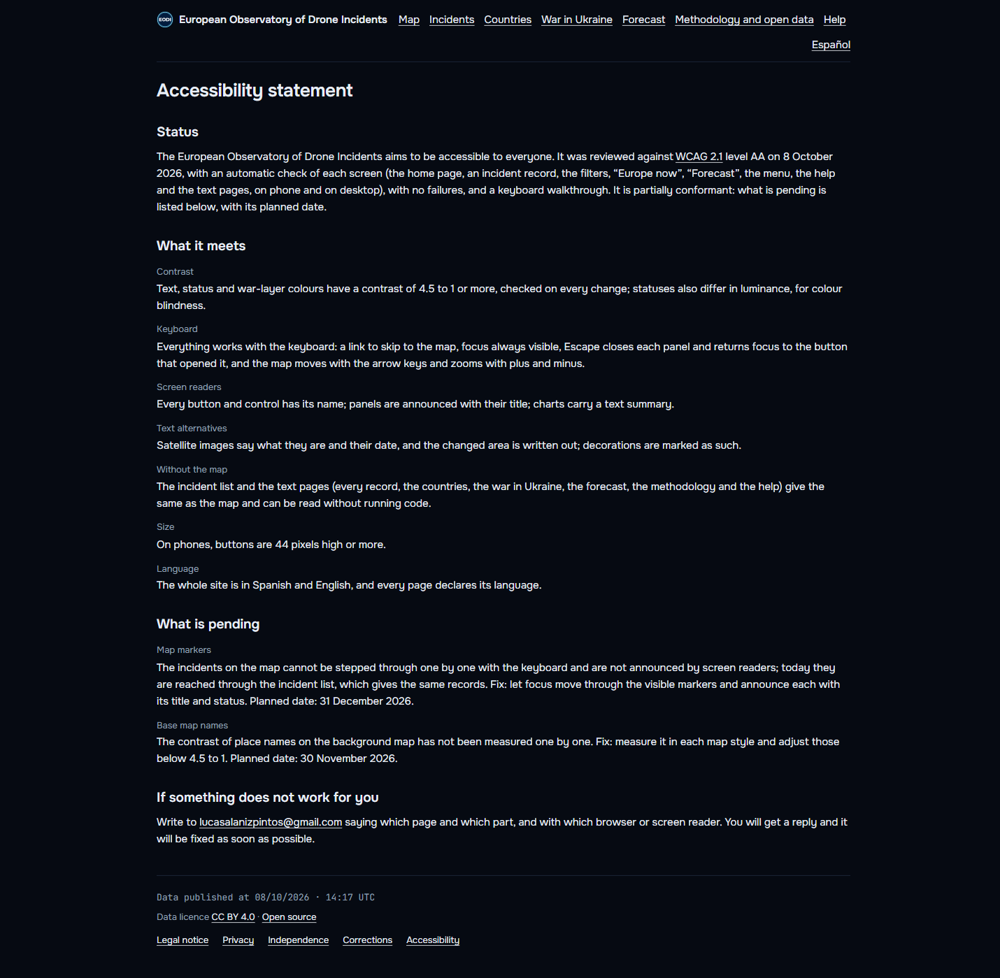
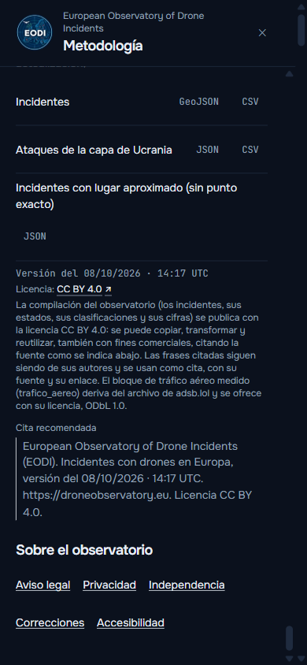

## Bloque 6. Recorrido como usuario nuevo

En producción, en 390 × 844 y en escritorio (y la primera carga también en 360 × 800 y 412 × 915),
en español y en inglés, mirando cada captura.

| Qué | Resultado |
| --- | --- |
| Primera carga, cabecera, contadores | Bien. 443 incidentes, 203 confirmados, 4 atribuidos, 28 países; sin desbordes a 360 px |
| Filtros: 24 h, 7 días, 30 días, año, Todo, entre fechas | Bien: 5, 17, 69, 316, 443 y 54 (septiembre); el botón dice el periodo |
| Frontera / interior | 211 + 232 = 443 |
| Clase de dron y estados | Bien; con «atribuido», confirmados = atribuidos = 4 |
| «Europa ahora» | 17 incidentes en 7 días = filtro de 7 días |
| «Novedades» | Coincide con el filtro de 24 horas; dice «registrado hace» y «ocurrió el» |
| «Previsión» | Como en el bloque 1, igual en los dos idiomas |
| Capas Incidentes, Ucrania (Corredores, Con satélite), Densidad, Presión, GPS | Bien, con su leyenda |
| «Noche a noche» y «En directo» | Bien |
| Fichas: atribuido (00134), confirmado (2025-00209), lugar aproximado (00492, 00489), recorrido oficial (2025-00306), impacto (Saky), corredor (Oriol → Poltava) | Bien; cerrar no mueve el mapa |
| Ayuda, metodología, páginas nuevas | Bien; la ayuda explica el marcador aproximado |
| Descarga de datos abiertos | 200, con licencia dentro y en la cabecera |
| Páginas de texto sin ejecutar código, sitemap, llms.txt | 200; el sitemap lleva las páginas nuevas |
| Enlace directo a un incidente; identificador unido | 200; los unidos redirigen con 308 a su incidente; uno inexistente da 404 |

Defectos encontrados y arreglados:

1. El marcador de un lugar aproximado de país quedaba dentro de un grupo al abrir su ficha (#176).
2. En el teléfono, la etiqueta de la descarga de lugar aproximado partía la fila y dejaba «JSON»
   solo en otra línea (#177).

Revisado y sin cambios: EODI-2026-00492 y EODI-2026-00496 (Moldavia, 7 de octubre) son dos sucesos,
uno por la mañana y otro por la tarde («o nouă dronă»); EODI-2026-00497 y EODI-2026-00498 salen de
una misma nota con dos aeropuertos cerrados (Lublin y Rzeszów), cada uno con su punto, como se hace
con cada aeropuerto cerrado.

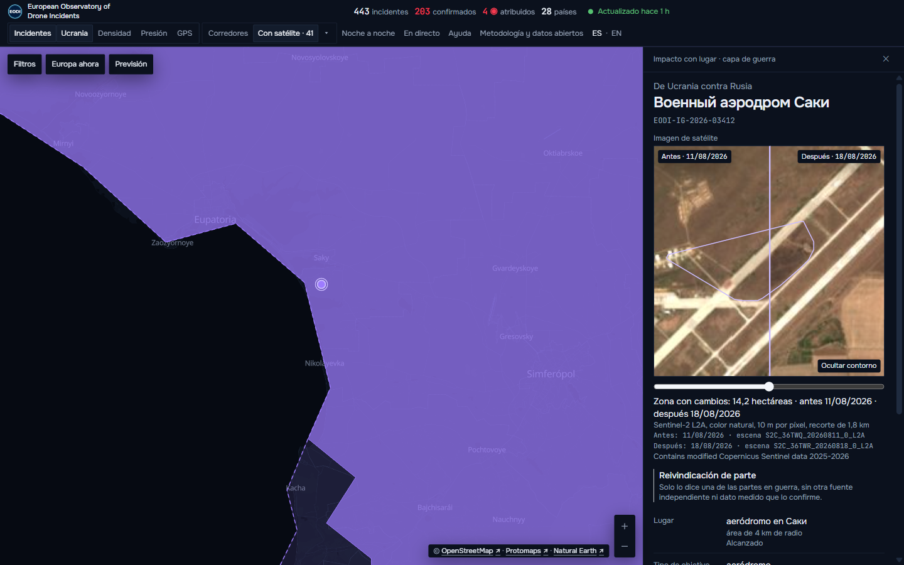
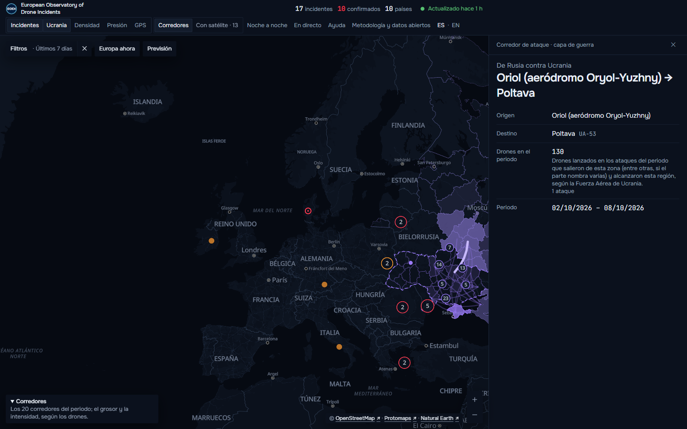
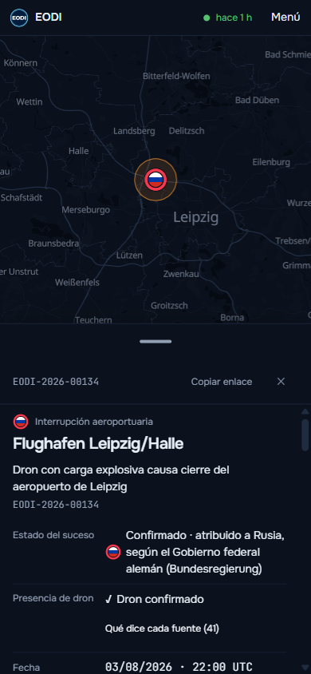
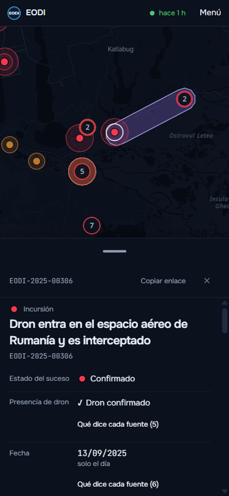
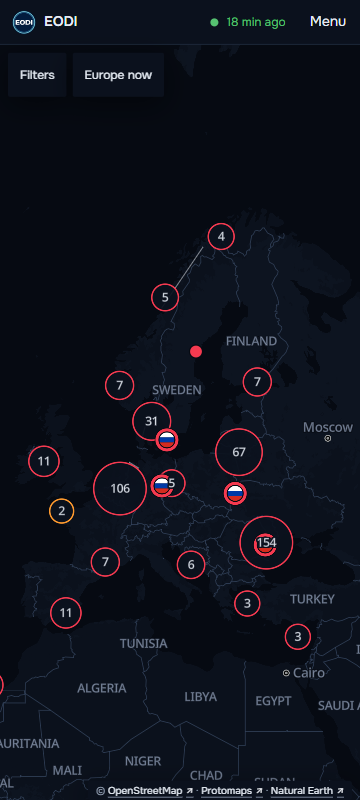

## Comprobación final

- **Primera carga** (`web/scripts/medir-carga.ts`, mediana, caché vacía): antes (13:44) escritorio
  264 ms de primera pintura y 2068 ms hasta el mapa listo, móvil 324 ms y 2907 ms; después (15:05)
  escritorio 268 ms y 2070 ms, móvil 328 ms y 2933 ms. Igual, dentro del ruido; el HTML de la portada
  pasa de 85,4 a 87,8 KB por el pie con los enlaces nuevos.
- **Recogidas tras las fusiones**:
  - tras #173: 15:17, código 0, publicó 444 incidentes; 16:17, código 0, publicó 445. Las dos con
    el aviso de la barrera por EODI-2025-00443, que se arregló en #178;
  - tras #178: 17:17, código 0, publicó 445, «registros revisados unidos: 1» y ningún aviso;
    18:17, código 0, publicó 446 y ningún aviso.
- **Vigilancia**: `salud.json` a las 18:35 UTC sin problemas ni avisos, y ninguna incidencia abierta en el repositorio.

## Pendientes, con su arreglo

1. **Accesibilidad: marcadores del mapa.** No se recorren uno a uno con el teclado ni los anuncia el
   lector de pantalla; hoy se llega por la lista. Arreglo: foco por los marcadores visibles con su
   título y su estado. Fecha prevista en la declaración: 31 de diciembre de 2026.
2. **Accesibilidad: nombres del mapa base.** Su contraste no se ha medido uno a uno. Arreglo:
   medirlo en cada estilo y ajustar los que no lleguen a 4,5 a 1. Fecha prevista: 30 de noviembre de
   2026. Las dos fechas son una propuesta: cámbialas en `web/src/texto/servicio.ts` si no te encajan.
3. **Nombre de la ficha de EODI-2026-00489.** La ficha española de Bulgaria lleva como nombre del
   lugar «exclusive economic zone», en inglés, porque es el `lugar.suceso` que guardó el extractor.
   Arreglo: una entrada en `configuracion/incidentes_revisados.json` con el lugar en la lengua de la
   fuente, o que la ficha no use como nombre un `suceso` genérico.
4. **Licencia dentro de los ficheros del almacén y de la exportación.** Los ficheros que se descargan
   de la web llevan la licencia; los del almacén público (`publicacion/`), que lee la web, no, para no
   cambiar su esquema. Arreglo, si se quiere: añadir el miembro `licencia` en
   `recogida/publicacion.py` con una versión nueva del esquema y el ensayo completo.
5. **Notas nuevas sobre sucesos antiguos.** Cada nota que vuelve sobre los drones del 9 al 10 de
   septiembre de 2025 (hoy, el archivo de la investigación) entra como incidente nuevo con la fecha
   que escribe y la barrera lo retiene si su cita no nombra el lugar del titular: hoy 2025-00442 y
   2025-00443, unidos a mano. Arreglo: que la regla de fusión una una nota con fecha escrita del
   suceso, del mismo país y del mismo tipo, al incidente publicado de ese día, como hace ya la
   revisión a mano; hasta entonces, unirlos en `configuracion/incidentes_revisados.json` cuando la
   vigilancia los señale («titulares_retenidos» en `salud.json`).
