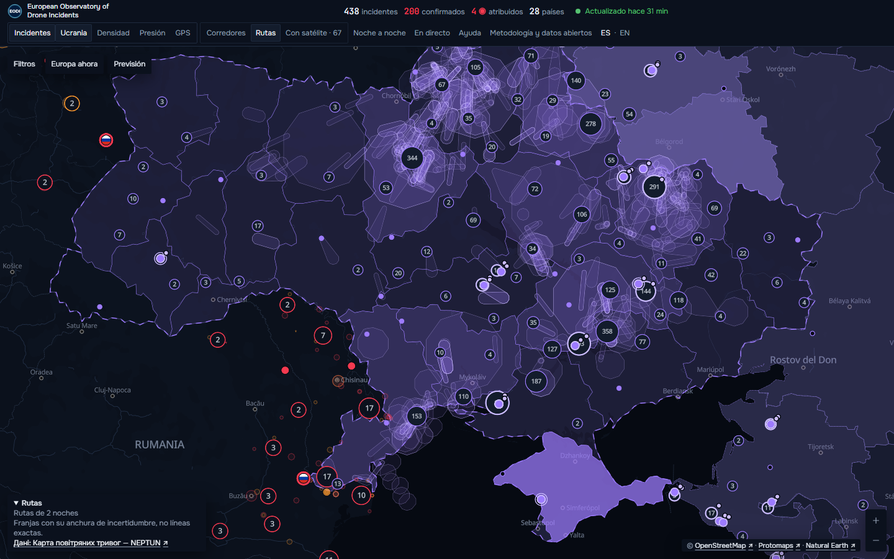
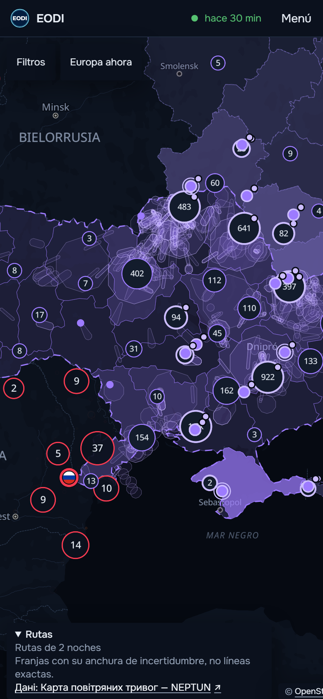
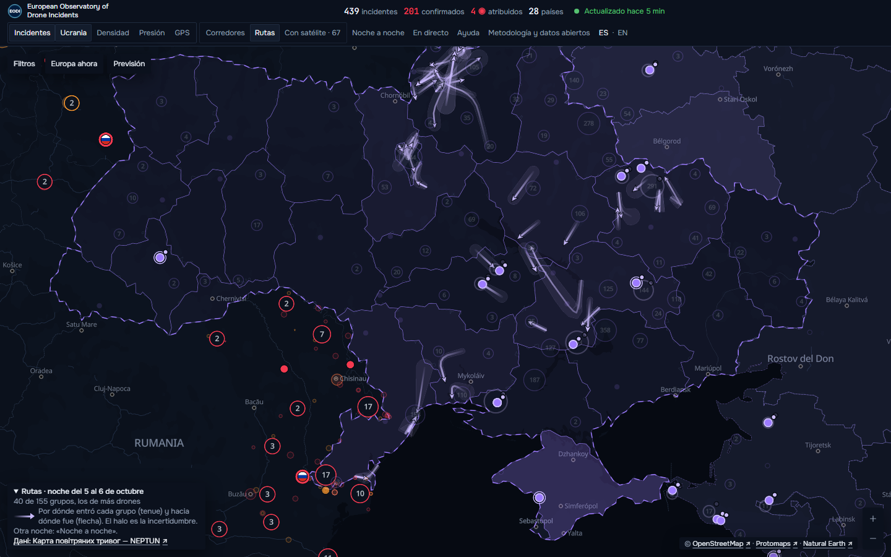
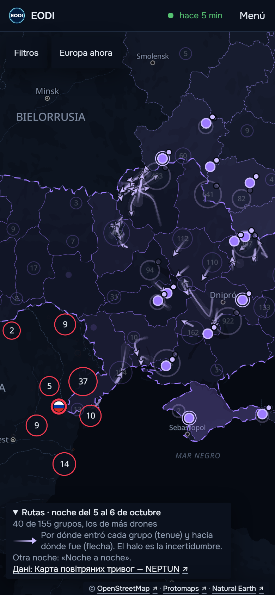

# Tipo de dron y rutas de los drones sobre Ucrania

European Observatory of Drone Incidents, 7 de octubre de 2026. Las horas son UTC. Fase 1 (tipo de
dron): PR #144, fusionado el 6 de octubre (`05a81bb`). Fase 2 (rutas y recorridos): PR #145,
fusionado el 7 de octubre (`5df612a`). Este informe va en su propio PR.

**En resumen.**

- Cada incidente de Europa tiene ahora una fila **«Tipo de dron»**. Hay tres casos: **lo dice la
  autoridad** (6 incidentes), **lo deduce el observatorio** con una probabilidad por clase y sus
  razones (69), o **no se muestra nada** (363) porque no hay datos suficientes.
- Las deducciones solo se publican para las dos clases que pasan la comprobación con casos de
  respuesta conocida: **dron de ataque de largo alcance de hélice** y **señuelo de largo
  alcance**. Las demás clases no se publican todavía.
- En «Filtros» hay un grupo nuevo, **«Tipo de dron»**, que filtra por lo identificado y por lo
  deducido por separado.
- Sobre Ucrania hay una subcapa nueva, **«Rutas»**, apagada al empezar: franjas violetas finas con
  su anchura de incertidumbre. Hoy se publican **2 noches** (4–5 y 5–6 de octubre), las dos con
  pistas de NEPTUN y su enlace.
- La reconstrucción de rutas con los mensajes de seguimiento de la Fuerza Aérea de Ucrania **no
  pasa** la comprobación contra NEPTUN y la línea recta, así que no se publica ninguna noche
  reconstruida con ellos. La comprobación se repite cada hora y publicaría sola si pasara.
- Cuatro incidentes de frontera tienen un **recorrido según la autoridad**: los lugares que nombra
  una declaración oficial, en orden, dibujados como franja al abrir la ficha.

## Qué ve el usuario

**En la ficha del incidente** hay una fila «Tipo de dron», debajo de «Drones»:

- *Lo dice la autoridad*: la clase («Señuelo de largo alcance», por ejemplo), la cita literal y su
  fuente. Si la autoridad nombra el modelo, se muestra tal cual lo dice ella.
- *Deducido*: «Dron de ataque de largo alcance de hélice · 5 de cada 10 (49 %)», «Señuelo de
  largo alcance · 4 de cada 10 (42 %)», «Otras clases: 9 %», con la frase «Deducido por el
  observatorio a partir de lo publicado; ninguna autoridad ha dicho qué dron era» y, plegado,
  «Por qué»: el punto de partida (cuántos casos conocidos de esa zona) y cada razón física que
  movió la probabilidad (distancia a Ucrania, Rusia o Bielorrusia frente al alcance de cada
  clase, velocidad, altura, duración, viento). Nunca se escribe un modelo concreto en lo
  deducido: siempre «compatible con» una clase.
- *Sin base*: la fila no aparece.

**En «Filtros»** un grupo «Tipo de dron» con las clases que tienen algún incidente, separando
«según la autoridad» y «deducido». Va en la dirección de la página (`?dron=`), como los demás.

**En la capa de Ucrania**, una subcapa más, **«Rutas»**, junto a «Corredores», apagada al
empezar. En el teléfono las subcapas pasan a una rejilla de tres para que quepan sin bajar al
mapa. Al encenderla:

- Franjas violetas finas, con relleno muy suave, por debajo de los marcadores del periodo. Con
  periodos largos se dibujan solo las noches con más drones (diez como máximo) y la leyenda lo
  dice: «Rutas de las 10 noches con más drones, de N del periodo».
- La leyenda, plegable, dice cuántas noches, que son franjas con su anchura de incertidumbre y no
  líneas exactas, y enlaza a NEPTUN.
- Al tocar una franja se abre su ficha: noche, grupo, tipo, tramo con sus horas, precisión
  («franja de 70 km de radio»), fuente con enlace a NEPTUN y los incidentes y el ataque de esa
  noche. Cerrarla no mueve el mapa.
- En **«Noche a noche»** se ven las rutas de la noche que se está mostrando, si las tiene.

**En la ficha de un incidente con recorrido**, una fila «Recorrido según la autoridad»
(«Biliaivka → Tudora»), con la cita, y en el mapa la franja que une cada dos lugares. Se quita al
cerrar la ficha.

**Páginas de texto** (las que se leen sin código): la página de cada incidente lleva la fila del
tipo de dron y la de recorrido; la página de Ucrania lleva un apartado de rutas; la metodología
tiene dos apartados nuevos, «Tipo de dron» y «Rutas».

**Exportación semanal**: formato 1.6.0. Cada incidente lleva `tipo_dron` y `recorrido`, y cada
valor tiene su regla de procedencia (autoridad, cita oficial o deducido por el observatorio, con
la versión del método). Lleva también las noches de ruta publicadas y las cifras por grupo.

## Cómo se obtiene y se comprueba cada cosa

### Tipo de dron que dice la autoridad

Se buscan en las fuentes de cada incidente los nombres de familias de drones (Shahed, Geran,
Gerbera, Orlan, Lancet, DJI, etc.) y se pasan a una de ocho clases. Cuenta solo lo que viene de una
fuente oficial o de una cita literal de la autoridad, y solo si no expresa duda («posiblemente»,
«similar a»). Se guarda la frase literal y su fuente; la cita se muestra solo si la fuente es
pública.

### Rasgos con cita

Un extractor en varios idiomas saca de los textos los rasgos que sirven para descartar clases:
velocidad, altura, duración, tamaño, número de aparatos, si venía del mar. Cada rasgo guarda su
cita y su fuente. Se probó con los textos de la base y se corrigieron falsos positivos (nombres
propios como Kleine-Brogel, «grande» referido a un aeropuerto, duraciones de un cierre tomadas
por la del vuelo, «enjambre» de policías).

### Tipo de dron deducido

Para cada incidente se parte de la frecuencia de cada clase en los casos conocidos de su zona
(frontera con la guerra o interior), quitando siempre el propio caso. Luego se aplican
restricciones físicas fijadas de antemano con su fuente en `configuracion/tipo_dron.json`:

- distancia a Ucrania, Rusia o Bielorrusia y a la costa frente al alcance de cada clase;
- viento y tiempo de esa hora y lugar, de la misma fuente meteorológica que ya usa el
  observatorio;
- duración y altura frente a la autonomía y el techo de cada clase;
- velocidad: por debajo de 230 km/h, hélice; por encima de 300 km/h, reacción.

**Comprobación.** 69 casos en los que una autoridad identificó el dron: 6 de la base, 23 del
conjunto de validación y 40 de los informes británicos de cuasi colisiones (de estos, solo los de
2017 en adelante cuentan para «ala fija», porque antes esa categoría era la que se ponía por
defecto). 31 tienen datos suficientes para deducir algo. Cada caso se calcula sin usarse a sí
mismo.

| | Método | Siempre la clase más frecuente | La más frecuente de su zona |
|---|---|---|---|
| Acierta la primera | 61 % (19 de 31) | 23 % (7 de 31) | 61 % (19 de 31) |
| Está entre las dos primeras | 94 % | 61 % | 94 % |
| Puntuación logarítmica por caso | −1,01 | −2,30 | −1,51 |

La puntuación logarítmica mide cuánta probabilidad se dio a lo que pasó: el método la mejora en
1,28 por caso frente a la referencia simple, y en 0,87 en el peor 10 % de 1.000 remuestreos. Frente
a la frecuencia por zona acierta igual en la primera clase, pero reparte mejor la probabilidad
(−1,01 frente a −1,51).

**Qué clases se publican.** Una clase se publica si tiene al menos 5 casos conocidos propios, mejora
la puntuación frente a la referencia y su probabilidad está bien calibrada (error de 0,1 como
máximo, medido por zona):

| Clase | Casos | Mejora | Error de calibración | Se publica |
|---|---|---|---|---|
| Ataque de largo alcance de hélice | 12 | 0,98 | 0,006 | sí |
| Señuelo de largo alcance | 10 | 0,89 | 0,004 | sí |
| Comercial pequeño | 4 | 0,49 | 0,037 | no (faltan casos) |
| Ala fija militar | 1 | — | — | no |
| Reacción | 1 | — | — | no |
| Multirrotor grande, FPV, ala fija pequeña | 0 | — | — | no |

El señuelo nunca sale primero en la frontera (el ataque de hélice lleva siempre algo más), pero su
probabilidad está bien calibrada: por eso se publica como probabilidad, junto a la otra, y no
como respuesta única. Un incidente muestra deducción solo si la presencia del dron está
confirmada, no está desmentido y su clase más probable es una de las publicadas; se enseñan las
clases publicadas con un 10 % o más y el resto va junto en «Otras clases».

### Rutas sobre Ucrania

**Fuentes.** Solo tres: el archivo de NEPTUN (estimaciones a partir de informes, no un radar), los
mensajes de seguimiento de la Fuerza Aérea de Ucrania (los del archivo en directo y unos 33.000
históricos, que se movieron al archivo del servidor sin volver a descargarlos) y las
declaraciones oficiales de Rumanía, Moldavia y Polonia para los recorridos.

**Conversión.** Cada mensaje se pasa a estructura (zona, rumbo, destino, tipo, número) noche a
noche, por trozos y con tope de memoria. Una noche va de las 12:00 de su día a las 12:00 del
siguiente. Resultado: **1.420 noches con mensajes, 37.152 mensajes de seguimiento** y 51.380
avisos de otro tipo; **1.354 pistas de NEPTUN**.

**Cuándo termina un ataque.** Una noche se da por terminada cuando ha pasado su ventana y además
dos horas desde su último mensaje. Nunca se publica una ruta de una noche en curso; hay una
prueba que lo comprueba.

**Franjas.** Cada tramo es una franja con su radio de incertidumbre (la precisión de la zona del
mensaje o la que da NEPTUN para su pista). Los grupos no se identifican por el texto: un tramo une
dos avisos compatibles en tiempo, rumbo y velocidad (250 km/h como máximo; 450 km/h los de
reacción; ventana de 3 horas), con divisiones y uniones marcadas. Cada tramo guarda los mensajes
de los que sale.

**Comprobación de la reconstrucción.** En las noches con NEPTUN se mide la distancia mediana de
cada posición de NEPTUN a la franja reconstruida activa a esa hora, y se compara con la línea
recta entre la zona de lanzamiento y los impactos de esa noche. Para publicar, la reconstrucción
tiene que ser al menos un 20 % mejor, mejor en cada noche y en 2 noches como mínimo.

- Primer intento: pasaba (33 km frente a 78 km), pero solo porque los avisos de región entera
  daban franjas de cientos de kilómetros que lo cubrían todo. En el mapa era una mancha violeta.
- Segundo intento, sin zonas de más de 90 km de precisión: **121,8 km frente a 77,3 km de la
  recta**, sobre 3.949 posiciones de NEPTUN en 2 noches. No pasa. Por la regla del encargo, se publican solo las noches con NEPTUN.

**Enlaces.** Cada noche se une a su ataque (los partes diarios), a los corredores y a los
incidentes de Europa que caen a 50 km de una franja más su radio. En las dos noches publicadas no
hay incidente europeo dentro de las franjas.

### Recorrido de las incursiones

Cuando una declaración oficial de Rumanía, Moldavia o Polonia nombra los lugares por los que pasó
el dron («desde la dirección de Biliaivka, Ucrania, hacia Tudora»), se sitúan con el nomenclátor y
GeoNames (a 80 km como mucho del incidente) y se dibujan en orden como franja. Hoy tienen recorrido
**EODI-2025-00306, EODI-2025-00328, EODI-2026-00193 y EODI-2026-00325**.

### Velocidad entre avistamientos

Cuando dos avistamientos de un mismo episodio dan una velocidad, se usa como restricción del tipo:
solo decide «reacción» si la velocidad mínima posible pasa de 300 km/h. Con los datos actuales
**ningún episodio ni recorrido decide nada**: las velocidades que salen están dentro de lo que
pueden hacer varias clases.

## Cifras en producción

- Tipo de dron, sobre 438 incidentes: **6 según la autoridad** (3 señuelo, 3 ataque de largo
  alcance de hélice), **69 deducidos** (todos con las dos clases publicadas; en 68 sale primero el
  ataque de hélice, en 1 el señuelo) y **363 sin nada**.
- Rutas: **2 noches publicadas**, 4–5 de octubre (329 tramos, 182 grupos, ataque
  EODI-UA-2026-1030 con 205 drones lanzados) y 5–6 de octubre (407 tramos, 217 grupos, ataque
  EODI-UA-2026-1033 con 137), las dos de NEPTUN. La noche del 6 al 7 se publicará sola cuando termine.
  Ninguna noche reconstruida con la Fuerza Aérea.
- Recorridos: **4 incidentes**.

## Pruebas

- **Integración continua**: casos conocidos fijados en `tests/fixtures/tipo_dron/` y
  `tests/fixtures/rutas/`; la prueba falla si el método del tipo de dron deja de mejorar a su
  referencia o si la reconstrucción de rutas pasara a publicarse sin pasar su comprobación.
  Esquemas validados (datos 1.15.0, rutas 1.0.0, exportación 1.6.0). Una prueba impide publicar
  rutas de un ataque en curso.
- **Ensayos** de la recogida horaria y de la exportación semanal sobre una copia de la base real,
  con código 0, antes de cada fusión.
- **Navegador**: 34 pruebas contra producción en 360×800, 390×844, 412×915 y escritorio, todas
  bien: incidentes identificado, deducido y sin base; filtro por clase; «Rutas» con 7 días, 30 días
  y «Todo», sola y con corredores; ficha de una ruta con enlace a NEPTUN, cuyo cierre no mueve el
  mapa; «Noche a noche» con rutas; recorrido de EODI-2026-00193 dibujado y quitado; páginas de
  texto. Las capturas de producción están en la carpeta de capturas de este trabajo,
  `eodi-tr-cap/prod2` (fuera del repositorio): `tipo-identificado-*`, `tipo-deducido-*`,
  `tipo-sin-base-*`, `tipo-filtro-*`, `rutas-7d-*`, `rutas-30d-*`, `rutas-todo-*`,
  `rutas-corredores-*`, `rutas-ficha-*`, `rutas-noche-a-noche-*` y `recorrido-*`, cada una en los
  cuatro tamaños.
- **Primera carga**, en la misma máquina y con los mismos datos, antes de la fase 1 frente a
  ahora, mediana de 10 pasadas con la caché vacía: escritorio **1.485 → 1.518 ms**, móvil (CPU 4
  veces más lenta) **2.366 → 2.420 ms**. La diferencia es menor que lo que varía una pasada de otra
  (unos 400 ms). El HTML crece 5,9 KB y el código de la aplicación 30 KB. Los datos de rutas no se
  piden en la primera carga: solo al encender la subcapa.
- **Recogidas tras cada fusión**: tras la fase 1, las de 22:17 y 23:17 del 6 de octubre terminaron
  bien y publicaron. Tras la fase 2, las de 01:17 y 02:17 del 7 de octubre, también (picos de
  memoria de 4,7 y 4,6 GB, con caché incluida, por debajo del tope de 5 GB). El trabajo nuevo
  `eodi-rutas` (minuto 8, tope de 1 GB) terminó bien a las 01:08 y a las 02:08 (pico de 511 MB).

## En el servidor

- Unidad nueva `eodi-rutas` (minuto 8 de cada hora, prioridad baja, tope de memoria de 1 GB y de
  30 minutos), con su propio cerrojo; nunca toma el de la recogida.
- La recogida horaria deja a las rutas los ataques de cada noche (`datos/rutas/ataques.json`).
- El archivo histórico de la Fuerza Aérea (49 ficheros mensuales, 16 MB) está en el archivo del
  servidor y copiado al bucket privado. La importación se hizo una vez a mano con prioridad baja.
- `eodi-seguimiento` no se ha parado ni reiniciado.
- Los ficheros publicados van al almacén público: `rutas/indice.json` y una noche por fichero
  (`rutas/noches/AAAA-MM-DD.json`). Si una noche se retira, su fichero se borra del almacén.

## Pendiente, con su arreglo

1. **Clase «comercial pequeño»**: tiene 4 casos conocidos propios y hacen falta 5. Arreglo: sumar
   casos de incautaciones policiales con el modelo identificado (comunicados de policía y fiscalía)
   al conjunto de validación; la comprobación lo publica sola al pasar.
2. **Rutas reconstruidas con la Fuerza Aérea**: no pasan (121,8 km frente a 77,3 km). Arreglo: situar
   mejor los avisos de región entera usando el rumbo y el destino del mensaje siguiente, y esperar
   más noches con NEPTUN. La comprobación se repite cada hora.
3. **Velocidad entre avistamientos**: ningún caso decide nada todavía. Arreglo: ninguno de código;
   se aplica sola cuando un episodio tenga dos avistamientos con hora y lugar precisos.
4. **Lugares de recorrido sin situar** (Izmail, Cotlovina, Valea Perjei, Lesnaia): por eso hay solo
   4 recorridos. Arreglo: añadir esas formas al nomenclátor con su región.
5. **Día 5 de octubre en el informe de la captura del seguimiento**: el día está en el archivo pero
   no en su índice. Arreglo: regenerar el índice del informe de la captura.

## 7 de octubre de 2026: rutas legibles y tipo de dron sin falsa precisión

PR #147, fusionado el 7 de octubre a las 08:03 UTC (`b451023`). Dos arreglos sobre lo publicado
la noche anterior, sin funciones nuevas.

### Tipo de dron

**Qué se veía.** De los 69 incidentes con tipo deducido, 68 decían casi lo mismo («dron de ataque
de largo alcance de hélice, 49 %; señuelo, 42 %»); 38 no enseñaban ninguna razón al desplegar y 28
solo la distancia a la frontera. Dos porcentajes casi iguales no distinguen nada.

**Por qué 38 no tenían razón.** La razón existía y no se guardaba: esos incidentes tienen base
porque el dron entró desde fuera en la zona de frontera, pero a esa distancia llegan todas las
clases, la distancia no cambia ninguna probabilidad y el cálculo solo guardaba las razones que
cambian algo. Ahora se guarda como razón propia («Entró desde fuera, a 3 km de Ucrania, Rusia o
Bielorrusia: dentro del alcance de los drones de largo alcance que se lanzan en la guerra»). Los
38 la tienen; ninguno se queda sin fila por esto.

**Qué se ha cambiado.**

- Comprobación nueva con los casos de respuesta conocida (`proceso/tipo_dron/comprobacion.py`):
  - *distinción*: en cuántos casos el método dijo un grupo doblando al segundo y en cuántos
    acertó. Para enseñar porcentajes hacen falta 5 casos y un 80 % de aciertos. Con los casos de
    hoy, en la frontera ninguno dobla al otro (como mucho, 1,3 veces): **no pasa**, y no se enseñan
    porcentajes en ningún incidente;
  - *familia de la guerra*: en cuántos casos el ataque de largo alcance y el señuelo juntos doblaban
    al resto y en cuántos era uno de los dos: **22 de 24 (92 %)**, pasa.
- Cuando no hay distinción, la fila dice una sola cosa, «Compatible con un dron de largo alcance de
  la guerra (de ataque o señuelo)» («Compatible with a long-range drone of the war (attack or
  decoy)»), con sus razones debajo, a la vista. Sin razón no hay fila.
- Los 6 identificados por la autoridad no cambian.
- Filtro «Tipo de dron»: «Identificado por la autoridad», con los modelos que nombra («Dron de
  ataque de largo alcance de hélice (Shahed, Shahed 138, Geran-2)», «Señuelo de largo alcance
  (Gerbera)»), y «Deducido por el observatorio» con una sola opción, «Compatible con dron de largo
  alcance de la guerra» (`?dron=deducido:guerra`).
- Páginas de texto y metodología dicen lo mismo. La exportación conserva las probabilidades
  calculadas con su regla de origen y añade cómo se presentan (`publicado.presentacion`). Esquema de
  datos 1.16.0, método `tipo-dron-1.1.0`, exportación 1.7.0.

**Cifras en producción** (recogida de las 08:17 del 7 de octubre, 441 incidentes evaluados):

| | Incidentes |
|---|---|
| Identificado por la autoridad | 6 |
| «Compatible con un dron de largo alcance de la guerra» | 69 |
| Con porcentajes | 0 |
| Sin fila | 366 (348 sin base y 18 con base cuyo grupo más probable no pasa la comprobación) |

### Rutas

**Qué se veía.** Al encender «Rutas»: cientos de cápsulas cortas sueltas (329 tramos en una noche),
polígonos de ocho lados de región entera, todo semitransparente y superpuesto, dos noches a la vez
y mezclado con los círculos de impactos. La leyenda, en algunos teléfonos, salía cortada por la
izquierda.

**Qué se ha cambiado.**

- **Un grupo, una línea** (`proceso/rutas/recorridos.py`). NEPTUN parte el vuelo de un grupo en
  pistas cortas (la mitad dura menos de 8 minutos). Dos pistas se unen si la segunda empieza entre
  10 minutos antes y 30 minutos después de que la primera llegue a su último punto, cabe a 250 km/h
  y va en la misma dirección (60° como mucho), y solo si es la única que puede seguir a la primera
  y la primera la única que puede precederla. Si un grupo con varios aparatos se divide o se une,
  la línea se bifurca o se junta; cualquier otra duda deja las pistas sin unir. Cada recorrido va
  suavizado, de su principio a su final.
- **Dirección**: la línea es casi transparente en el origen, más marcada hacia el final y termina
  en una punta de flecha.
- **Sin manchas de región**: un punto con 45 km o más de incertidumbre, o un aviso «por región»,
  no se dibuja; solo une el recorrido si hay puntos precisos antes y después.
- **Incertidumbre**: un halo alrededor de la línea, de 2 a 15 km a cada lado según la precisión de
  cada punto, muy suave de lejos.
- **Una noche cada vez**: la última terminada, u otra en «Noche a noche». La leyenda dice qué noche.
- **Sin maraña**: solo tienen recorrido los grupos que se desplazan 20 km o más; se dibujan los 40
  con más aparatos (a igualdad, los más largos), con grosor y opacidad según el tamaño y los mayores
  encima. La leyenda dice «40 de 155 grupos, los de más drones».
- **Convivencia**: con «Rutas» a la vista, los impactos se atenúan y el relleno de las regiones
  baja a un tercio; las rutas van en violeta claro con flecha, distintas de los arcos de los
  corredores.
- **Leyenda entera**: en el teléfono la leyenda compartía fila con las atribuciones; la fila era
  más ancha que la pantalla y, alineada a la derecha, la leyenda se salía por la izquierda (en
  Chromium la fila desbordaba por la derecha y lo que se cortaba eran las atribuciones). Ahora van
  una encima de otra; vale para todas las leyendas de la capa (rutas, corredores, presión, GPS). Se
  comprobó de 320 a 1440 px de ancho, con letra al 125 %, en los dos idiomas, con corredores y con
  «Noche a noche».
- **Ficha del grupo** al tocar la línea o su halo: noche, grupo, aparatos, tipo y velocidad cuando
  constan, longitud y horas, precisión, fuente con su enlace a NEPTUN y las pistas. Cerrarla no
  mueve el mapa.
- **Fichero de cada noche** (esquema de rutas 1.1.0): lleva los recorridos ya unidos (líneas, halo
  y flecha); los tramos siguen como datos de partida, sin franja. Se sube comprimido: una noche pasa
  de unos 310 KB a 60 KB. La exportación semanal (1.7.0) lleva también los recorridos, con su regla
  de origen (`recorridos-1.0.0`, calculado). Las dos noches publicadas se regeneraron a las 08:34;
  la del 6 al 7 de octubre se publicará sola cuando termine (a partir de las 14:00 UTC).

**Cifras**: noche del 4 al 5 de octubre, 507 pistas de NEPTUN y 155 grupos con recorrido; noche del
5 al 6, 527 pistas y 155 grupos. Con las uniones, una pista de cada cinco forma parte de un
recorrido de varias.

### Comprobaciones

- Puerta local (pytest, ruff, mypy, base de prueba de la exportación) y CI en verde; pruebas nuevas
  de recorridos (unión, duda, división, región entera, orden) y del tipo de dron (distinción,
  familia, razón guardada, sin razón no hay fila).
- Ensayo de la recogida y de la exportación semanal sobre una copia de la base real en el servidor:
  código 0; después, la exportación de las rutas ya calculadas valida.
- Recogidas de las 08:17 y las 09:17 tras fusionar: correctas (código 0) y publicadas, con picos de
  4,7 GB (con caché). Las rutas del minuto 8 de las 09:00 terminaron con código 0. Incidentes
  publicados: 439 antes y después.
- Navegador, en producción, en 360×800, 390×844, 412×915 y escritorio (30 pruebas, todas bien):
  rutas solas y con corredores, de lejos y acercando al norte y al sur; ficha de un grupo y su
  cierre; «Noche a noche»; recorrido de una incursión; un incidente identificado, uno «compatible
  con» con su razón y uno sin fila; el filtro; y las páginas de texto sin ejecutar código.
- Rendimiento en un teléfono emulado (CPU 4 veces más lenta, red 4G): las rutas están dibujadas
  entre 0,38 y 0,55 s después de que el mapa esté listo; al mover el mapa, los mismos cuadros por
  segundo con rutas que sin ellas (19–20 en esta máquina). Primera carga: las rutas no se piden en
  ella; el código crece 2,7 KB comprimidos en total (HTML, aplicación, mapa y estilos).

### Pendiente, con su arreglo

1. **Porcentajes**: con los casos conocidos de hoy, ningún rasgo descrito separa el ataque de largo
   alcance del señuelo, así que no se enseñan porcentajes en ningún incidente. Arreglo: sumar casos
   de respuesta conocida con rasgos (velocidad, ruido, tamaño) de las declaraciones oficiales; la
   comprobación de distinción publica los porcentajes sola cuando pase.
2. **Un incidente que antes tuviera fila sin razones y ahora no la tenga**: no lo hay, porque los 38
   tenían su razón sin guardar. La prueba de navegador comprueba la ausencia de fila con un
   incidente sin base. Arreglo: ninguno de código.
3. **Recorridos cortos**: aun unidos, la mitad de los recorridos mide 40 km o menos, porque NEPTUN
   pierde a muchos grupos y abre pistas nuevas lejos. Arreglo: unir también con los mensajes de la
   Fuerza Aérea de la misma noche cuando un mensaje sitúe al grupo entre dos pistas, con la misma
   regla de no inventar identidades.

## 7 de octubre de 2026: rutas apagadas en la web

- Las rutas sobre Ucrania dejan de enseñarse en la web: sin subcapa «Rutas», sin ficheros de rutas en el almacén público y sin describirlas en la metodología ni en la página de Ucrania; el recorrido oficial de las incursiones sigue a la vista.
- El servidor las sigue capturando, calculando y guardando cada hora (`datos/rutas/publicar/`), con su comprobación, y la exportación semanal las sigue llevando con su regla de origen.
- Para volver a encenderlas: poner `"mostrar": true` en `configuracion/rutas_en_la_web.json` y fusionar; la web las enseña al desplegarse y el trabajo de rutas del minuto 8 siguiente a la recogida las vuelve a subir al almacén público.
